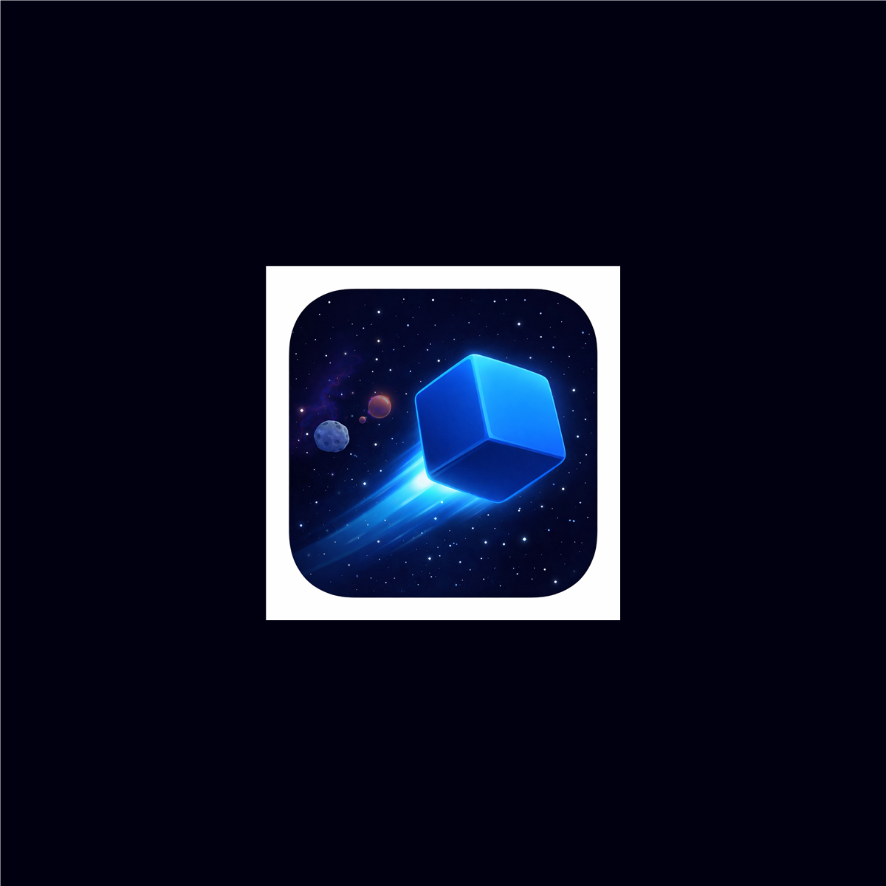

# VOID³



**VOID³** — это захватывающая 3D космическая игра-аркада, где вы управляете кубиком в бесконечном космосе, избегая астероидов и собирая редкие бонусы. Устанавливайте рекорды и сохраняйте их на блокчейне Base.

## 🎮 О игре

VOID³ — это динамичная игра на выживание в космосе. Ваша цель — как можно дольше уклоняться от приближающихся астероидов, которые становятся всё быстрее и быстрее. Собирайте редкие бонусы для временного ускорения и соревнуйтесь с другими игроками в лидерборде на блокчейне Base.

### Основные механики

- 🎯 **Управление кубиком** — плавное движение пальцем или мышью
- ☄️ **Избегание астероидов** — уклоняйтесь от обычных и больших астероидов
- 🎯 **Целевые астероиды** — редкие астероиды, которые преследуют вас
- ⚡ **Бонусы X2 скорости** — редкие бонусы удваивают скорость на 5 секунд
- 📈 **Прогрессия сложности** — скорость увеличивается с каждыми 100 очками
- 🏆 **Блокчейн лидерборд** — сохраняйте рекорды на Base blockchain

## ✨ Особенности

- **Полностью 3D графика** — построено на React Three Fiber и Three.js
- **Плавное управление** — оптимизировано для сенсорных экранов
- **Ретро-футуристический дизайн** — минималистичный стиль в космической тематике
- **Блокчейн интеграция** — рекорды сохраняются в смарт-контракте на Base
- **Адаптивная камера** — динамическое следование за игроком для лучшего обзора
- **Оптимизация производительности** — плавный FPS на мобильных устройствах

## 🛠️ Технологии

- **[Next.js 14](https://nextjs.org/)** — React фреймворк с SSR
- **[React Three Fiber](https://docs.pmnd.rs/react-three-fiber)** — 3D рендеринг в React
- **[Three.js](https://threejs.org/)** — 3D графика и анимации
- **[Zustand](https://zustand-demo.pmnd.rs/)** — легковесный state management
- **[Base MiniApp SDK](https://docs.base.org/mini-apps/)** — интеграция с Base App
- **[Solidity](https://soliditylang.org/)** — смарт-контракты для лидерборда
- **[Hardhat](https://hardhat.org/)** — разработка и деплой контрактов

## 🎨 Дизайн

Игра выполнена в минималистичном ретро-футуристическом стиле:
- Темная космическая тема (#000011)
- Неоновые акценты (#4a9eff)
- 3D модели астероидов и игрока
- Плавные анимации и эффекты частиц
- Адаптивная цветовая схема (светлая/темная тема)

## 🚀 Установка и запуск

```bash
# Установка зависимостей
npm install

# Запуск в режиме разработки
npm run dev

# Сборка для продакшена
npm run build
npm start
```

## 📝 Конфигурация

Создайте `.env.local` с переменными окружения:

```env
NEXT_PUBLIC_CONTRACT_ADDRESS=0x...  # Адрес смарт-контракта
NEXT_PUBLIC_URL=https://your-app.vercel.app  # URL приложения
NEXT_PUBLIC_BASE_APP_ID=696fd000b1df0aaec05af3c8  # Base App ID (опционально, по умолчанию используется ваш ID)
```

## 🎮 Как играть

1. **Начните игру** — нажмите кнопку "Start"
2. **Управляйте кубиком** — двигайте пальцем/мышью по экрану
3. **Избегайте астероидов** — уклоняйтесь от всех препятствий
4. **Собирайте бонусы** — зеленые пульсирующие бонусы удваивают скорость
5. **Устанавливайте рекорды** — чем дольше выживаете, тем больше очков
6. **Сохраняйте на блокчейне** — лучшие рекорды сохраняются в смарт-контракте

## 📊 Структура проекта

```
├── app/
│   ├── components/Game/     # Игровые компоненты
│   ├── lib/                 # Утилиты и интеграции
│   └── stores/              # State management
├── contracts/               # Solidity смарт-контракты
├── public/
│   ├── models/             # 3D модели (GLB)
│   └── music.mp3           # Фоновая музыка
└── scripts/                # Скрипты деплоя контрактов
```

## 🔗 Ссылки

- [Base App](https://base.org) — экосистема Base
- [Base Mini Apps Docs](https://docs.base.org/mini-apps/) — документация
- [React Three Fiber](https://docs.pmnd.rs/react-three-fiber) — 3D в React

## 📄 Лицензия

MIT License

---

Сделано с ❤️ для Base Mini Apps
